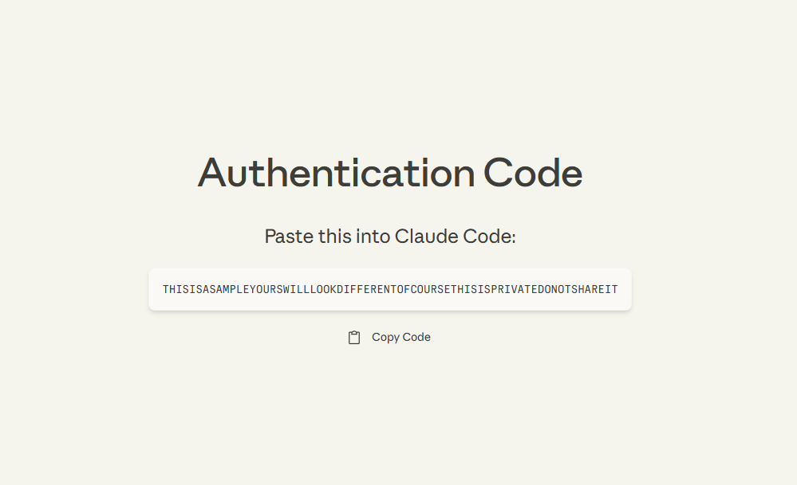
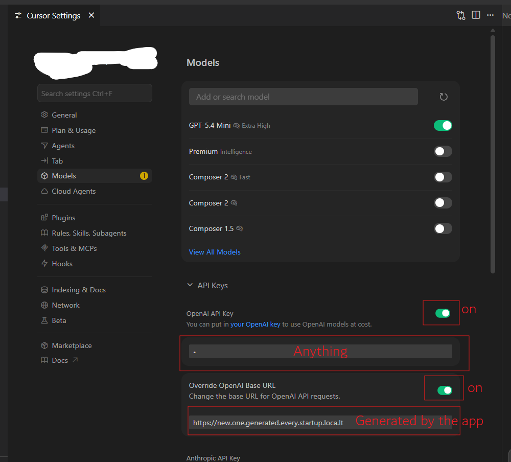

# claudsor

Use Cursor with Claude money.

## Quickstart

### Usage

No installation needed! Just run:

```bash
npx claudsor
```

A browser tab will open for Anthropic login. Paste the returned code back into the terminal.



The terminal will then print something like

```
Responses-compatible endpoint: http://localhost:5090
Logs -> ./logs/{input,output,errors}.jsonl

claudsor v0.3.0
  local:   http://localhost:5090
  tunnel:  https://grumpy-views-cross.loca.lt
  config:  C:\Users\JW\.claudsor
  logs:    C:\Users\JW\.claudsor\logs

Paste into Cursor -> Settings -> Models -> OpenAI Base URL:
  https://grumpy-views-cross.loca.lt
```

Paste the URL (in this case `https://grumpy-views-cross.loca.lt`) into **Cursor → Settings → Models → OpenAI Base URL**. You also need to put in something in the `OpenAI API Key` field, but it can be anything.



From there on, any model starting with `gpt-` will be routed to the server. 

Congrats! 🎉

## Model mapping

| Client model         | Claude            |
| -------------------- | ----------------- |
| `gpt-*-codex`            | `claude-opus-4-7` |
| Anything else with `gpt-`        | `claude-sonnet-4-6` |
| `gpt-*-nano`, `gpt-*-mini`   | `claude-haiku-4-5`|

## Developing Locally

```bash
git clone https://github.com/shotnothing/claudsor
cd claudsor
npm install
node index.js
```

Layout:

- `index.js` :  CLI entry, banner, shutdown
- `cli.js` :  arg parser
- `paths.js` :  resolves `~/.claudsor` (token + logs)
- `auth.js` :  Anthropic OAuth + token refresh
- `claude.js` :  `fetch` wrapper for `/v1/messages`
- `translate.js` :  OpenAI <-> Anthropic translation (request + SSE)
- `server.js` :  HTTP server on `--port`
- `tunnel.js` - `localtunnel` wrapper
- `logger.js` :  JSONL logs (`input`, `output`, `errors`, `http`)

Tail the logs to watch traffic:

```bash
tail -f ~/.claudsor/logs/input.jsonl
tail -f ~/.claudsor/logs/errors.jsonl
```
